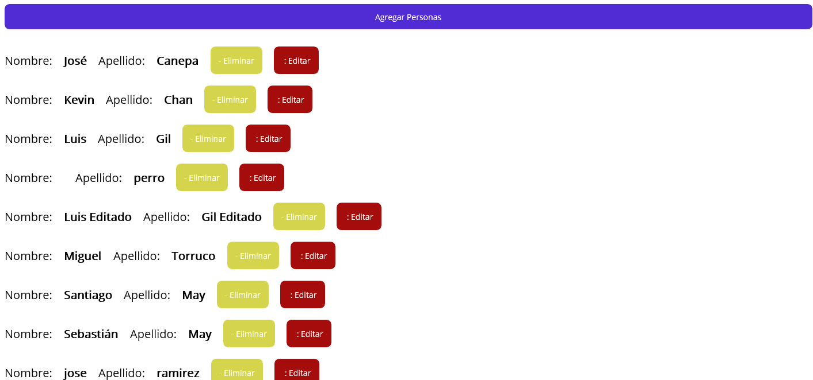
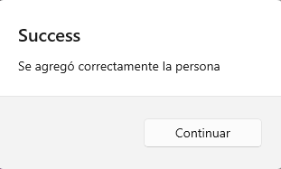
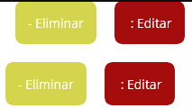
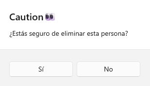
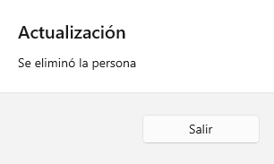
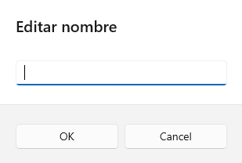
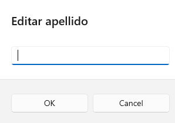
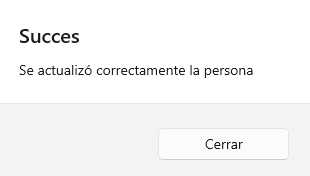

# Scholar System MAUI / Sistema escolar MAUI
*Este repositorio contiene un proyecto elaborado en MAUI, el cual consiste en conectarse a la API proporcionada por el docente, con la finalidad de mandar peticiones **PATCH/GET/DELETE** para la manipulación de la información*

<h1>¿Cómo funciona?  </h1> 
Lo primero que veremos al entrar en la aplicación es esta imagen
 

Donde podemos ver el listado de las personas (Estos están almacenados en la base de datos).  

<b>El botón que dice "Agregar personas"</b>

*En caso de realizarse con exito la adición, veremos esta leyenda* 

Regresando a la vista principal, podremos ver dos botones (Uno para eliminar el registro y otro para editar el registro)  

Si se presiona el boton "- Eliminar", eliminaremos el registro del dato, pero se nos preguntará si realmente queremos borrar el registro  
  

Al realizarse con exito veremos esta pestaña  
  

Por último, el botón editar, si lo presionamos nos pedirá el nombre nuevo que queremos digitar  
  
Para despues pedirnos el apellido  
  
Si se realiza con exito el cambio, veremos esta pestaña  

  
Así es el funcionamiento basico